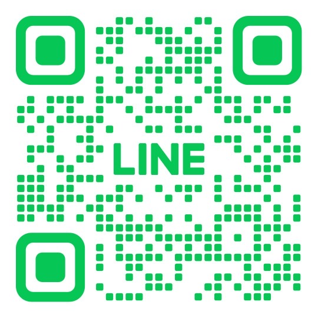

<!DOCTYPE html>
<html lang="ja">
<head>
  <meta charset="UTF-8">
  <meta name="viewport" content="width=device-width, initial-scale=1.0">
  <title>レンタル宅建士｜内見同行サービス</title>
  
</head>
<body>

<header>
  <h1>レンタル宅建士</h1>
  
あなたの内見に、プロの目を。

</header>

<section>
  <h2>サービス概要</h2>
  

    <!-- こちらに画像①を表示 -->
    
  

  

    レンタル宅建士は、お客様の物件内見に同行し、 
    不動産のプロとして中立的な視点からアドバイスを行うサービスです。
  

  

    営業担当者とは異なる立場から、物件のメリット・デメリットを率直にお伝えします。 
    内見に同席しながら「気づかなかったポイント」や「注意すべき点」を一緒に確認することで、 
    安心して住まい選びを進めていただけます。
  

  <ul>
    <li>営業トークに流されず、冷静な判断材料を得られる</li>
    <li>専門家の目線でリスクや注意点を指摘</li>
    <li>契約前の不安を軽減し、納得感を持って判断できる</li>
  </ul>
</section>

<section class="price">
  <h2>料金プラン</h2>
  

    当サービスの料金は、<strong>お客様ご自身で自由にお決めいただけます。</strong> 
    当日にかかる交通費のみ、実費でご負担をお願いしております。
  

  

    「このサービスにどれくらいの価値を感じたか」を基準に 
    ご自由にお心付けをお考えください。
  

</section>

<section>
  <h2>お問い合わせ</h2>
  <form>
    <label>お名前： <input type="text" name="name"></label>  
    <label>メール： <input type="email" name="email"></label>  
    <label>希望日程： <input type="text" name="date"></label>  
    <label>ご相談内容： <textarea name="message" rows="5"></textarea></label>  
    <button type="submit">送信</button>
  </form>

  

    
LINEでもお問い合わせできます

    <!-- ↓ここに実際のLINE公式アカウントのリンクを入れる -->
    <a href="https://lin.ee/UWYrkzC" target="_blank" class="line-button">LINEで問い合わせる</a>
    
    

      
QRコードからも友だち追加できます

      <!-- 実際のQRコード画像をアップロードして src を差し替え -->
      
    

  

</section>

<footer>
  
© 2025 レンタル宅建士

  
※本サービスは宅地建物取引業の仲介業務ではなく、助言を目的としています。

</footer>

</body>
</html>
